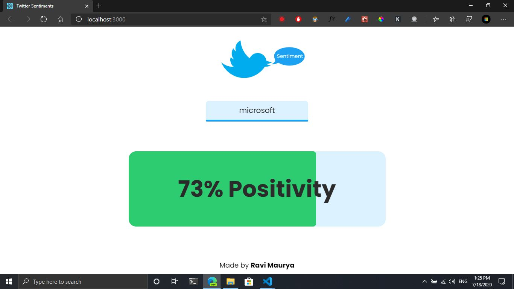
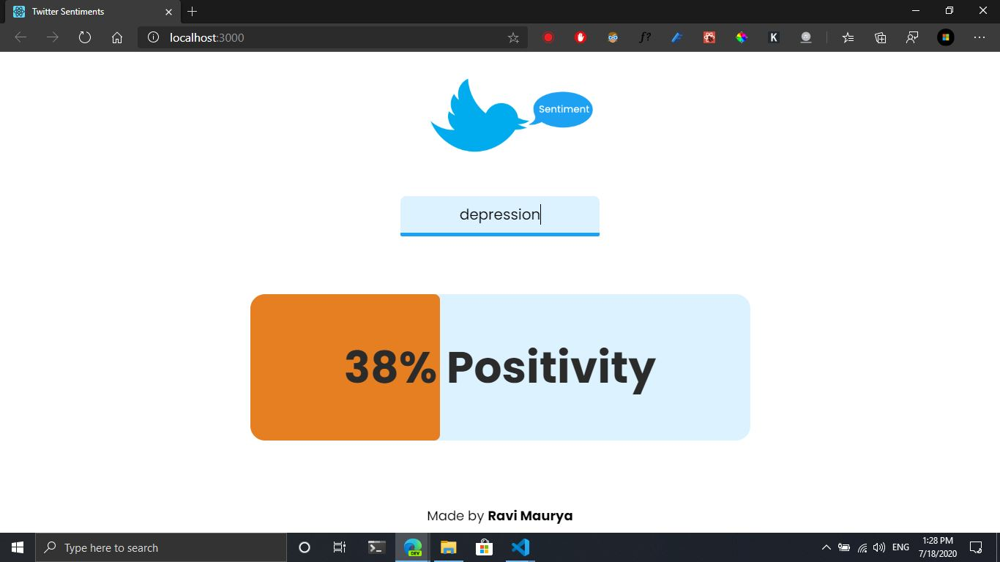
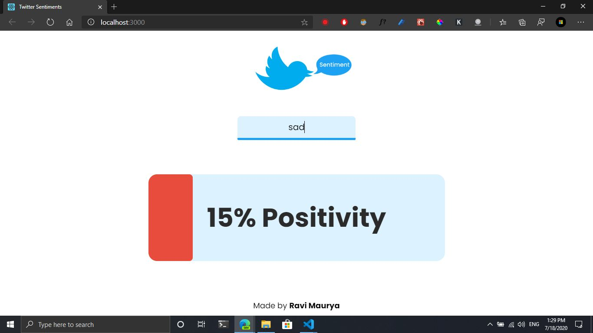

# **Twitter Sentiment Analysis**

Pulls latest/top 100 tweets on the searched topic and gives percent of Positivity on that topic.<br>

## How to run?
### Server
```
cd server
python app.py
```

### Client
```
cd client\twitter-senti
npm start
```

## Screenshots





### Note: In server directory, create .env file and add your Twitter API Bearer Key as bearerKey

## 👩‍💻 Author
- **Ravi Maurya**